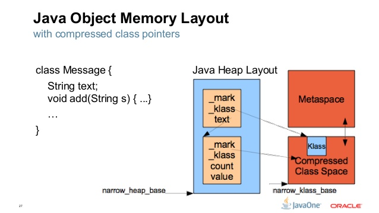
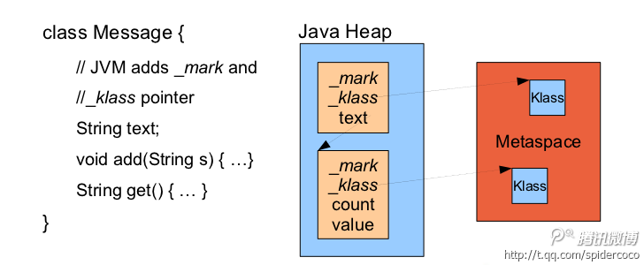
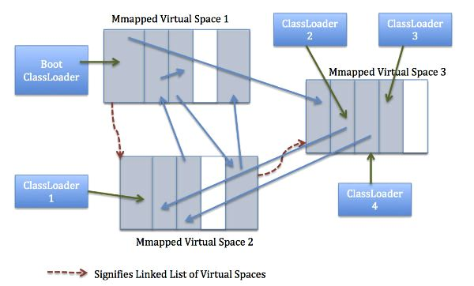

#### 一、从方法区\(PermGen\)到元空间\(Metaspace\)

> - 作者：高稷
> - 链接：https://www.jianshu.com/p/a6f19189ec62
> - 来源：简书
> - 著作权归作者所有。商业转载请联系作者获得授权，非商业转载请注明出处。

- **方法区(PermGen)**

1.  JDK1.8 以前的 HotSpot JVM 有**方法区**，也叫**永久代(permanent generation)** 。
2.  方法区用于存放已被虚拟机加载的**类信息、常量、静态变量，即编译器编译后的代码**。
3.  方法区是一片**连续的堆空间**，通过 **-XX:MaxPermSize**来设定永久代最大可分配空间，当 JVM 加载的类信息容量超过了这个值，会报**OOM:PermGen**错误。
4.  永久代的 **GC** 是和老年代(old generation)捆绑在一起的，无论谁满了，都会触发永久代和老年代的垃圾收集。
5.  JDK1.7 开始了方法区的部分移除：**符号引用(Symbols)** 移至 **native heap**，**字面量(interned strings)** 和 **静态变量(class statics)** 移至 **java heap**。

- **为什么要用 Metaspace 替代方法区**  
  随着动态类加载的情况越来越多，这块内存变得不太可控，如果设置小了，系统运行过程中就容易出现内存溢出，设置大了又浪费内存。

#### 二、Metaspace 的组成

Metaspace 由两大部分组成：Klass Metaspace 和 NoKlass Metaspace。

- **Klass Metaspace**

1.  Klass Metaspace 就是用来存**klass**的，就是 class 文件在 jvm 里的运行时数据结构（不过我们看到的类似 A.class 其实是存在 heap 里的，是 java.lang.Class 的对象实例）。
2.  这部分默认放在**Compressed Class Pointer Space**中，是一块连续的内存区域，  
    紧接着 Heap，和之前的 perm 一样。通过-XX:CompressedClassSpaceSize 来控制这块内存的大小，默认是 1G。  
    下图展示了对象的存储模型,\_mark 是对象的 Mark Word,\_klass 是元数据指针

3.  Compressed Class Pointer Space **不是必须有的**，如果设置了 **-XX:-UseCompressedClassPointers**，或者 **-Xmx 设置大于 32G**，就不会有这块内存，这种情况下 klass 都会存在 NoKlass Metaspace 里。

- **NoKlass Metaspace**

1.  NoKlass Metaspace 专门来存 klass 相关的其他的内容，比如 method，constantPool 等，可以由多块不连续的内存组成。
2.  这块内存是必须的，虽然叫做 NoKlass Metaspace，但是也其实可以存 klass 的内容，上面已经提到了对应场景。
3.  NoKlass Metaspace 在本地内存中分配。

- **指针压缩**

1.  64 位平台上默认打开
2.  设置-XX:+UseCompressedOops 压缩对象指针， **oops**指的是普通对象指针(ordinary object pointers)， 会被压缩成 32 位。
3.  设置-XX:+UseCompressedClassPointers 压缩类指针，会被压缩成 32 位。

#### 三、Metaspace 内存管理

1.  在 metaspace 中，类和其元数据的生命周期与其对应的类加载器相同，只要类的类加载器是存活的，在 Metaspace 中的类元数据也是存活的，不能被回收。
2.  每个加载器有单独的存储空间。
3.  省掉了 GC 扫描及压缩的时间。
4.  当 GC 发现某个类加载器不再存活了，会把对应的空间整个回收。

Metaspace VM 使用一个**块分配器(chunking allocator)**来管理 Metaspace 空间的内存分配。块的大小依赖于类加载器的类型。  
Metaspace VM 中有一个全局的可使用的**块列表（a global free list of chunks）**。当类加载器需要一个块的时候，类加载器从全局块列表中取出一个块，添加到它自己维护的块列表中。当类加载器死亡，它的块将会被释放，归还给全局的块列表。  
块（chunk）会进一步被划分成 blocks,每个 block 存储一个元数据单元(a unit of metadata)。Chunk 中 Blocks 的是分配线性的（pointer bump）。这些 chunks 被分配在内存映射空间(memory mapped(mmapped) spaces)之外。在一个全局的虚拟内存映射空间（global virtual mmapped spaces）的链表，当任何虚拟空间变为空时，就将该虚拟空间归还回操作系统。

metachunks.jpg

上面这幅图展示了 Metaspace 使用 metachunks 在 mmapeded virual spaces 分配的情形。

#### 四、metaspace 的主要参数

MetaspaceSize  
MaxMetaspaceSize  
CompressedClassSpaceSize  
MinMetaspaceExpansion  
MaxMetaspaceExpansion  
MinMetaspaceFreeRatio  
MaxMetaspaceFreeRatio  
UseLargePagesInMetaspace  
InitialBootClassLoaderMetaspaceSize

#### MetaspaceSize

metaspaceGC 发生的初始阈值，也是最小阈值，默认 20.8M 左右，与之对比的主要是指 Klass Metaspace 与 NoKlass Metaspace 两块 committed 的内存和。

- 触发 metaspaceGC 的阈值是不断变化的：当 metaspace 使用的内存接近阈值时，会尝试增大阈值。metaspaceGC 后也会调整阈值。

#### MaxMetaspaceSize

由于 metaspace 大部分在本地内存中分配，默认基本是无穷大，但仍然受本地内存大小的限制。为了防止 metaspace 被无止境使用，建议设置这个参数。

- 这个参数会限制 metaspace(包括了 Klass Metaspace 以及 NoKlass Metaspace)被 committed 的内存大小，会保证 committed 的内存不会超过这个值，一旦超过就会触发 GC。
- 和 MaxPermSize 的区别，根据 MaxMetaspaceSize，并不会在 jvm 启动的时候分配一块这么大的内存出来，而根据 MaxPermSize 分配的内存则是固定大小。

#### CompressedClassSpaceSize

Compressed Class Pointer Space 区域的大小，默认 1G。  
如果设置了-XX:-UseCompressedClassPointers，或者-Xmx 设置大于 32G，则这个参数不生效。

#### MinMetaspaceExpansion

MinMetaspaceExpansion 和 MaxMetaspaceExpansion 这两个参数这两个参数和扩容其实并没有直接的关系，并不是为了增大 committed 的内存。  
主要是在比较特殊的场景下救急使用，增大触发 metaspace GC 的阈值，延迟 GC 的发生。  
默认 332.8K，增大触发 metaspace GC 阈值的最小要求。  
如果需要分配的内存小于 MinMetaspaceExpansion，则将 metaspace GC 的阈值提升 MinMetaspaceExpansion。

#### MaxMetaspaceExpansion

默认 5.2M，增大触发 metaspace GC 阈值的最大要求。  
如果需要分配的内存大于 MinMetaspaceExpansion 但是小于 MaxMetaspaceExpansion，那增量就是 MaxMetaspaceExpansion。  
如果需要分配的内存超过了 MaxMetaspaceExpansion，那增量就是 MinMetaspaceExpansion 加上要分配的内存大小

注：每次分配只会给对应的线程一次扩展触发 metaspace GC 阈值的机会，如果扩展了，但是还不能分配，那就只能等着做 GC 了。

#### MinMetaspaceFreeRatio

MinMetaspaceFreeRatio 和下面的 MaxMetaspaceFreeRatio，主要是影响触发 metaspaceGC 的阈值。

默认 40，表示每次 GC 完之后，如果 metaspace 内存的空闲比例小于 MinMetaspaceFreeRatio\%，那么将尝试做扩容，增大触发 metaspaceGC 的阈值。  
不过这个增量至少是 MinMetaspaceExpansion 才会做，不然不会增加这个阈值。  
这个参数主要是为了避免触发 metaspaceGC 的阈值和 gc 之后 committed 的内存的量比较接近，于是将这个阈值进行扩大。

注：这里不用 gc 之后 used 的量来算，主要是担心可能出现 committed 的量超过了触发 metaspaceGC 的阈值，这种情况一旦发生会很危险，会不断做 gc，这应该是 jdk8 在某个版本之后才修复的 bug

#### MaxMetaspaceFreeRatio

默认 70，这个参数和上面的参数基本是相反的，是为了避免触发 metaspaceGC 的阈值过大，而想对这个值进行缩小。  
这个参数在 gc 之后 committed 的内存比较小的时候并且离触发 metaspaceGC 的阈值比较远的时候，调整会比较明显。

#### UseLargePagesInMetaspace

默认 false，这个参数是说是否在 metaspace 里使用 LargePage，一般情况下我们使用 4KB 的 page size，这个参数依赖于 UseLargePages 这个参数开启，不过这个参数我们一般不开。

#### InitialBootClassLoaderMetaspaceSize

64 位下默认 4M，32 位下默认 2200K，metasapce 前面已经提到主要分了两大块，Klass Metaspace 以及 NoKlass Metaspace，而 NoKlass Metaspace 是由一块块内存组合起来的，这个参数决定了 NoKlass Metaspace 的第一个内存 Block 的大小，即 2\*InitialBootClassLoaderMetaspaceSize，同时为 bootstrapClassLoader 的第一块内存 chunk 分配了 InitialBootClassLoaderMetaspaceSize 的大小

#### 五、jstat 里的 metaspace 字段

我们看 GC 是否异常，除了通过 GC 日志来做分析之外，我们还可以通过 jstat 这样的工具展示的数据来分析，前面我公众号里有篇文章介绍了 jstat 这块的实现，有兴趣的可以到我的公众号你假笨里去翻阅下 jstat 的这篇文章。

我们通过 jstat 可以看到 metaspace 相关的这么一些指标，分别是**M，CCS，MC，MU，CCSC，CCSU，MCMN，MCMX，CCSMN，CCSMX**

#### MC \& MU \& CCSC \& CCSU

- MC 表示 Klass Metaspace 以及 NoKlass Metaspace 两者总共 committed 的内存大小，单位是 KB，虽然从上面的定义里我们看到了是 capacity，但是实质上计算的时候并不是 capacity，而是 committed，这个是要注意的
- MU 这个无可厚非，说的就是 Klass Metaspace 以及 NoKlass Metaspace 两者已经使用了的内存大小
- CCSC 表示的是 Klass Metaspace 的已经被 commit 的内存大小，单位也是 KB
- CCSU 表示 Klass Metaspace 的已经被使用的内存大小

#### M \& CCS

- M 表示的是 Klass Metaspace 以及 NoKlass Metaspace 两者总共的使用率，其实可以根据上面的四个指标算出来，即\(CCSU+MU\)/\(CCSC+MC\)
- CCS 表示的是 NoKlass Metaspace 的使用率，也就是 CCSU/CCSC 算出来的

PS：所以我们有时候看到 M 的值达到了 90\%以上，其实这个并不一定说明 metaspace 用了很多了，因为内存是慢慢 commit 的，所以我们的分母是慢慢变大的，不过当我们 committed 到一定量的时候就不会再增长了

#### MCMN \& MCMX \& CCSMN \& CCSMX

- MCMN 和 CCSMN 这两个值可以忽略，一直都是 0
- MCMX 表示 Klass Metaspace 以及 NoKlass Metaspace 两者总共的 reserved 的内存大小，比如默认情况下 Klass Metaspace 是通过 CompressedClassSpaceSize 这个参数来 reserved 1G 的内存，NoKlass Metaspace 默认 reserved 的内存大小是 2\* InitialBootClassLoaderMetaspaceSize
- CCSMX 表示 Klass Metaspace reserved 的内存大小

参考资料  
[https://www.jianshu.com/p/92a5fbb33764](https://www.jianshu.com/p/92a5fbb33764)  
[https://www.jianshu.com/p/1a0b4bf8d498](https://www.jianshu.com/p/1a0b4bf8d498)  
[https://www.cnblogs.com/duanxz/p/3520829.html](https://www.cnblogs.com/duanxz/p/3520829.html)
